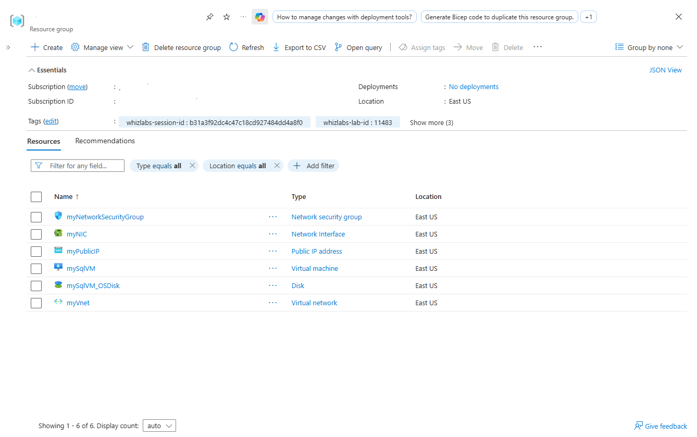
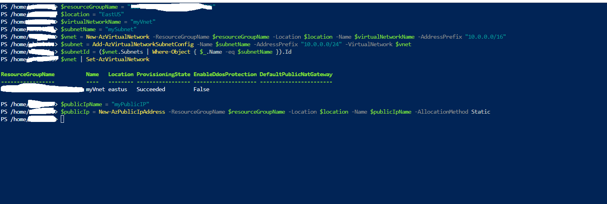
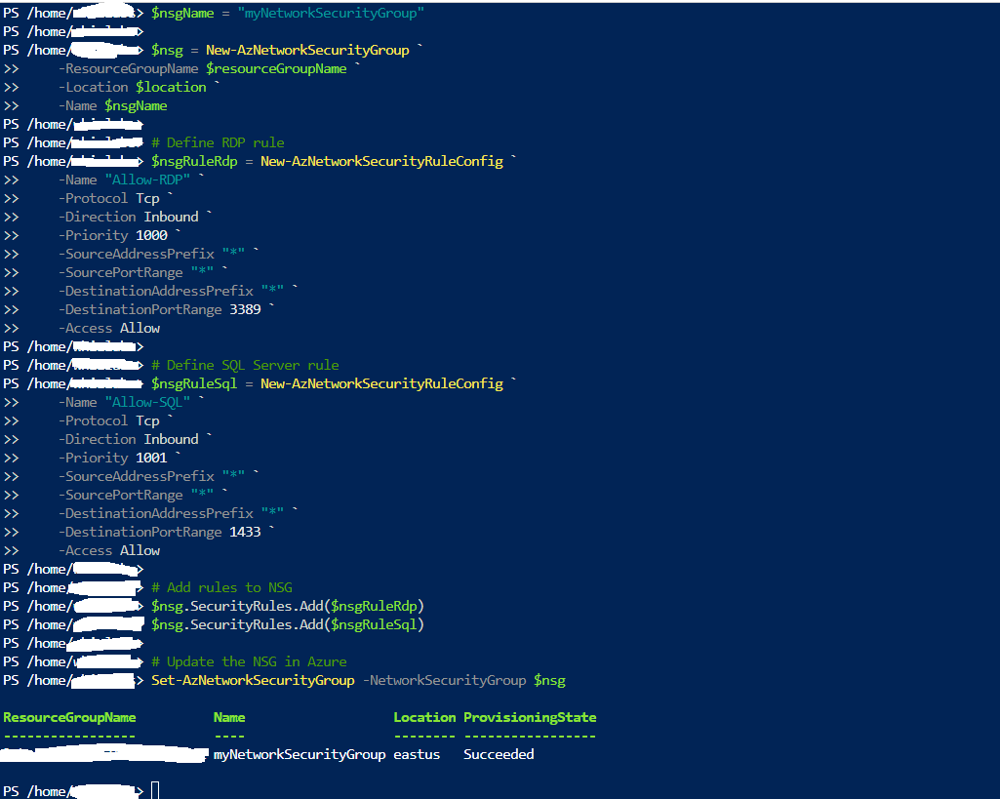
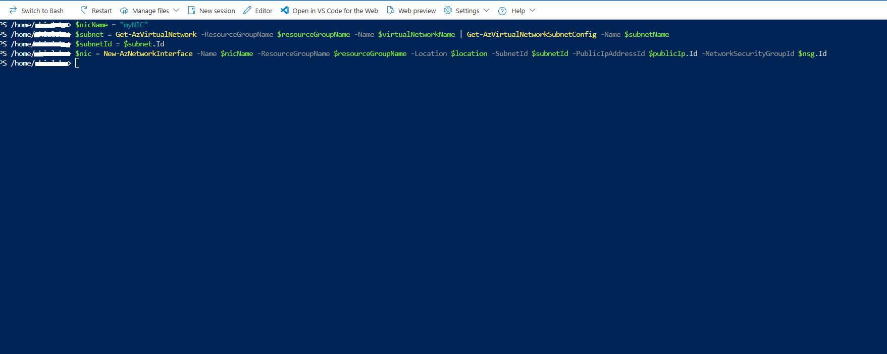
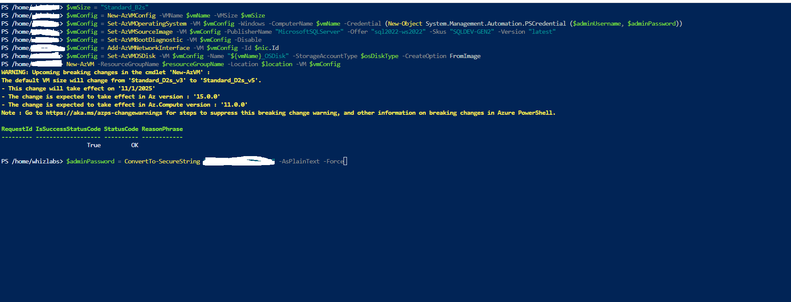
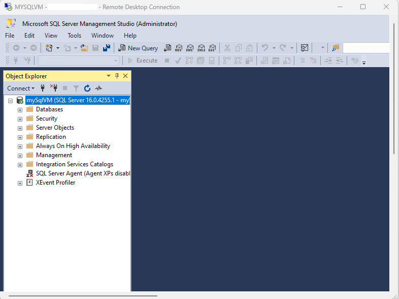

# Provisioning SQL Server on Azure VM via Azure PowerShell 

A step-by-step implementation guide detailing the deployment, configuration, and verification of Microsoft SQL Server 2022 on a Windows Server 2022 Azure Virtual Machine using Azure PowerShell.

---

## 1.Architecture & Provisioned Resources

All lab resources were provisioned in the East US region under a dedicated resource group.

* Virtual machine: mySqlVM - Standard_B2s VM size, Windows Server 2022 with SQL Server 2022 Developer edition (SQLDEV-GEN2), Trusted Launch security, 127 GB Standard SSD OS disk
* Network interface: myNIC - Primary interface attached to mySqlVM, linked to myPublicIP, mySubnet, and protected by myNetworkSecurityGroup
* Public IP address: myPublicIP - Static IPv4 address (20.85.217.48) with Standard SKU
* Virtual network: myVnet - Address space 10.0.0.0/16 with subnet mySubnet (10.0.0.0/24)
* Network security group: myNetworkSecurityGroup - Perimeter ingress security rules for RDP (TCP 3389) and SQL Server (TCP 1433)

*Resource group overview showing all provisioned networking, compute, storage, and security resources.*

---

## 2. Step-by-Step PowerShell Implementation

### Step 1: Deploy Virtual Network, Subnet, and Public IP

Defined deployment parameters and created the foundational virtual networking resources and static public IP using Azure PowerShell.

1. Initialized variables for the target resource group, East US location, virtual network name myVnet, and subnet name mySubnet.
2. Created the virtual network with address prefix 10.0.0.0/16 and added subnet mySubnet with address prefix 10.0.0.0/24.
3. Created the static public IP resource myPublicIP.

*Creating virtual network myVnet, subnet mySubnet, and public IP myPublicIP via PowerShell.*

---

### Step 2: Configure Network Security Group Rules

Provisioned the Network Security Group myNetworkSecurityGroup and configured inbound access rules for management and database traffic.

1. Created myNetworkSecurityGroup in the target resource group and location.
2. Defined rule Allow-RDP with priority 1000 allowing TCP port 3389 inbound traffic.
3. Defined rule Allow-SQL with priority 1001 allowing TCP port 1433 inbound traffic.
4. Attached the security rules and updated the Network Security Group configuration in Azure.

*Configuring and applying inbound security rules for RDP and SQL Server connectivity.*

---

### Step 3: Create Network Interface

Provisioned the virtual network interface myNIC binding the networking and security components together before VM deployment.

1. Retrieved the subnet configuration object from myVnet.
2. Created network interface myNIC associating it with mySubnet, public IP myPublicIP, and network security group myNetworkSecurityGroup.

*Creating network interface myNIC and binding subnet, public IP, and NSG associations.*

---

### Step 4: Configure and Deploy the SQL Server VM

Constructed the virtual machine configuration and deployed the Windows Server 2022 virtual machine with pre-installed SQL Server 2022.

1. Specified compute sizing using the Standard_B2s SKU.
2. Configured Windows OS parameters with administrator credentials and disabled boot diagnostics.
3. Set the marketplace image source using publisher MicrosoftSQLServer, offer sql2022-ws2022, and SKU SQLDEV-GEN2.
4. Attached network interface myNIC and configured the managed OS disk mySqlVM_OSDisk with Standard SSD storage.
5. Deployed the virtual machine mySqlVM into Azure.

*Defining VM configuration parameters and executing VM deployment via PowerShell.*

---

### Step 5: Connect and Verify SQL Server Management Studio

Validated end-to-end functionality and accessibility of the database engine inside the running instance.

1. Connected to mySqlVM over Remote Desktop Protocol (RDP) using the assigned public IP.
2. Launched Microsoft SQL Server Management Studio (SSMS) as administrator.
3. Connected to the local database engine instance (mySqlVM - SQL Server 16.0.4255.1) and verified database engine services and catalog structures.

*Connecting to SQL Server 2022 instance via SQL Server Management Studio inside the VM.*

